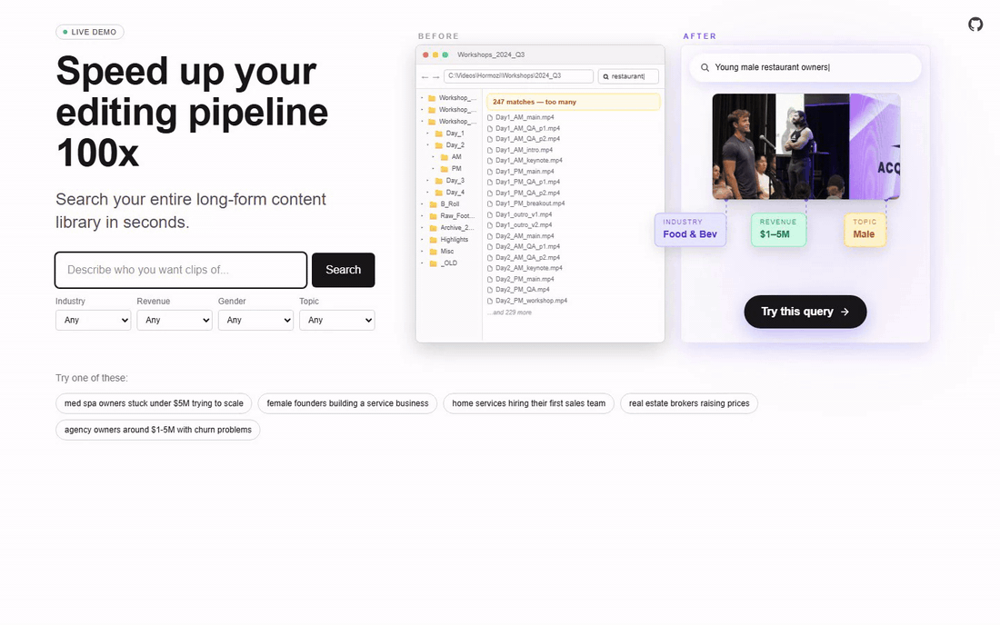

# Workshop Search and Retrieval Tool Long-Form Content Library

A production-grade AI-native search and retrieval system over a 500+ minute long-form Q&A workshop library. A non-technical editor types something like *"med spa owners under $5M trying to scale"* and the system returns ranked, timestamped attendee sessions ready to drop into an edit.

The same retrieval surface is exposed three ways: a web portal for editors, a JSON API for internal tooling, and an MCP server for AI agents.


## What it costs to find one clip

| | Manual editor scrubbing | This system |
|---|---|---|
| Time per clip | 30 to 60 minutes | 2 to 3 seconds |
| Cost per clip | $25 to $80 (1 hr × $50 to $80 senior-editor rate) | $0.0018 (less than two-tenths of a cent) |
| Scales linearly with corpus | Yes (3x footage = 3x time) | No (10x footage = same latency) |
| Repeatable for a different ICP | Start the search from scratch | Same query in seconds |

Concrete per-month numbers for a studio finding 100 clips:

| | Editor scrubbing only | With this system |
|---|---|---|
| Search labor | 75 hours | 5 minutes |
| Labor cost at $60/hr | $4,500 | $5 |
| OpenAI inference cost | $0 | $0.18 |
| **Total** | **$4,500** | **~$5** |

That is roughly a **900x latency reduction** per clip and a **25,000x cost reduction** per query, before counting opportunity cost of the editor's time on the work that actually requires a human.

### Per-query cost breakdown

At OpenAI list pricing:

| Stage | Model | Tokens (typical) | Cost |
|---|---|---|---|
| Filter extraction | `gpt-4o-mini` | 530 in / 100 out | $0.000140 |
| Query embedding | `text-embedding-3-small` | ~30 | $0.0000006 |
| LLM judge re-rank | `gpt-4o-mini` | ~250 in / 30 out × 30 candidates | $0.001665 |
| **Total per query** |  | | **~$0.0018** |

Vector search (Qdrant) and Postgres reads add no marginal cost. Per-query cost is logged to `query_log` in Postgres; a rolling 24-hour sum drives the `DAILY_COST_CEILING_USD` circuit breaker on `/api/search/sessions`.

| Item | One-time cost (per session) |
|---|---|
| Ingest tagger + audit (Claude Sonnet 4.6) | ~$0.005 |
| Session embedding | ~$0.000005 |

Full re-ingest of the current ~71-session corpus is about $0.40 in inference plus Deepgram transcription minutes.

## What it does

The corpus is a library of long-form workshop videos where one host fields questions from a rotating cast of business owners. Each video contains multiple attendee Q&A sessions back-to-back, with no chapter markers.

The system:

- Splits each video into individual attendee sessions using voice fingerprinting plus speaker-cluster boundary detection.
- Tags each session with structured attributes the host team actually filters on (industry, revenue band, attendee gender, conversation topics, summary, audit-verified quote).
- Indexes every session into Qdrant with an OpenAI text embedding plus the structured filters as payload.
- Serves a hybrid retrieval surface: natural-language filter extraction, dense vector retrieval, structured-filter intersection, and a final LLM re-ranker.

The editor never sees the pipeline. They type a query, get back a list of clips, click play, YouTube opens at the right second.

## Architecture

```
                       +--------------------------------------+
                       |           Web (Next.js 16)           |
                       |  - / homepage (server component)     |
                       |  - Mobile + desktop animated demos   |
                       |  - IP-count gate (5 free per 24h)    |
                       |  - Login (cookie-based bypass)       |
                       |  - /api/mcp (MCP server, token-gated)|
                       +------------------+-------------------+
                                          |
                            +-------------+-------------+
                            v                           v
              +-------------------------+   +-------------------------+
              |     Search pipeline     |   |        MCP tools        |
              |     (lib/sessions.ts)   |   |      (lib/search.ts)    |
              +------------+------------+   +------------+------------+
                           |                              |
            +--------------+---------------+              |
            v              v               v              v
       +---------+   +----------+   +----------+   +----------+
       | OpenAI  |   |  Qdrant  |   |   Neon   |   | Upstash  |
       | embed + |   |  vector  |   | Postgres |   |  Redis   |
       | judge   |   |  search  |   | (truth)  |   | (rate)   |
       +---------+   +----------+   +----------+   +----------+
                           ^
                           |
              +------------+------------+
              |     Ingest pipeline     |
              |       (Python)          |
              |  yt-dlp -> Deepgram ->  |
              |  Resemblyzer -> session |
              |  boundaries -> Claude   |
              |  tagger -> audit gate   |
              |  -> embed -> upsert     |
              +-------------------------+
```

## Ingest pipeline

`ingest/` is a Python pipeline organized as discrete stages so each can be re-run independently.

| Stage | Module | Output |
|---|---|---|
| Fetch | `stages/fetch.py` | Raw audio + video metadata via `yt-dlp` |
| Transcribe | `stages/transcribe.py` | Deepgram nova-3 word-level timestamps + speaker clusters |
| Voice fingerprint | `stages/diarize.py` | Resemblyzer compares each cluster to a reference clip of the host. Voice-match band widened so split host clusters both score as host |
| Session boundaries | `stages/sessions.py` | Per-video session start/end derived from cluster transitions, with hand-verified `boundary_overrides.py` for the 4 long-form videos |
| Frame extraction | `stages/frames.py` | One representative frame per session at `start_s + 200/23.976s` |
| Tag | `stages/tag_session_v2.py` | Claude Sonnet 4.6 emits industry, revenue, gender, topics, summary, plus a verbatim supporting quote |
| Audit | `stages/tag_session_v2.py` | Separate Claude call judges whether the quote supports each tag. Failed tags fall back to `other` |
| Embed | `vectors.py` | OpenAI `text-embedding-3-small` over the residual session text + summary |
| Upsert | `vectors.py` | Qdrant points keyed by `session_id` with structured payload |
| Dedupe | `scripts/dedupe_sessions.py` | Cross-video summary-embedding similarity clusters near-duplicate sessions into `dup_group_id` |

The ingest pipeline writes ground-truth metadata to Neon Postgres and vector embeddings to Qdrant Cloud. Postgres is the source of truth for filters and metadata; Qdrant is the dense retrieval index.

## Search pipeline

`web/lib/sessions.ts` orchestrates the runtime search.

```
NL query
   |
   v
[1] extractFilters (gpt-4o-mini, structured-output JSON schema)
   | {industry, revenueBands[], gender, topics[], residualText}
   v
[2] embed (text-embedding-3-small over residualText OR raw query)
   |
   v
[3] Qdrant search with hard payload filter on revenue/gender. Industry and
   | topics are SOFT — the extractor's guesses no longer gate the candidate
   | pool, only an editor's explicit UI dropdown pick does. This keeps
   | general queries ("service-based businesses") from being silently
   | hard-filtered down to one of 20 industry slugs.
   | topK = 30 candidates
   v
[4] LLM judge pass (gpt-4o-mini) scores each candidate 0..1
   | for "is this what the editor asked for"
   v
[5] Collapse: same-video same-cluster, then cross-video dup_group_id
   |
   v
[6] Render: timestamped session cards with YouTube deep-link (?t=start_s-1)
```

## Evaluation and monitoring

- **Golden set** lives at `eval/golden_queries.yaml`. Each query lists expected `(video_id, t_min, t_max)` tuples that any reasonable retrieval should surface.
- `scripts/eval.ts` runs the golden set plus 30 random paraphrased queries and reports recall@5, recall@10, and MRR. The latest report is written to `web/public/eval-latest.json` and rendered at `/eval` (dev-only, gated by `ENABLE_DEV_ROUTES`).
- **Per-query cost telemetry** is logged to `query_log` in Postgres. A rolling 24h sum feeds the `DAILY_COST_CEILING_USD` circuit breaker on `/api/search/sessions`.
- **Rate limiting**: Upstash sliding-window 30 req/min per IP and fixed 10k/day global, enforced in `proxy.ts`.
- **IP-count free tier**: anonymous IPs get 5 free searches per 24h (`lib/searchGate.ts`) before being redirected to `/login`. The password unlocks unlimited searches via a 30-day cookie.

## Stack

**Ingest pipeline** (Python 3.11)
- `yt-dlp`, `ffmpeg`, Deepgram nova-3
- Resemblyzer for speaker fingerprinting
- Anthropic Claude Sonnet 4.6 (tagger + audit)
- OpenAI `text-embedding-3-small` (vector index)

**Web** (Next.js 16, React 19, Tailwind v4)
- Server components for the home page and result rendering
- Client components for the animated hero and progress UI
- Liquid-glass search animation with phased state machine (`requestAnimationFrame`)

**Storage**
- Neon Postgres (sessions, videos, query_log, eval_queries, eval_labels)
- Qdrant Cloud (dense vector index, structured payload filters)
- Vercel Blob (extracted frames)
- Upstash KV / Vercel KV (rate limiting + IP-count gate)

**Inference**
- OpenAI `gpt-4o-mini` for filter extraction, LLM judge, residual paraphrasing
- OpenAI `text-embedding-3-small` for retrieval embeddings
- Anthropic Claude Sonnet 4.6 for the ingest-time tagger + audit (one-time per session)

**Agent interface**
- `@modelcontextprotocol/sdk` server at `/api/mcp` exposes `search_sessions` and `search_moments` tools. Bearer-token gated by `MCP_TOKEN` (required, fails closed).

## Security model

- **No secrets in the repo**. `.env*` is gitignored; `.env.example` documents every required variable.
- **Prompt injection mitigation** at `web/lib/extract.ts`: the editor's free-text query is passed inside `<query>` XML tags with explicit instructions to treat its contents as data, never as instructions. The structured output schema acts as a second containment layer.
- **Constant-time password compare** in the login API (`web/app/api/login/route.ts`) to avoid timing-leak signal on a single-credential demo.
- **Cookie flags**: `httpOnly`, `sameSite=lax`, `secure` when HTTPS. 30-day rolling expiry.
- **Internal routes** (`/eval`, `/v/[id]`, `/api/eval/*`, `/api/search*`) are gated server-side by `ENABLE_DEV_ROUTES`. The home page does not depend on any of them.
- **Rate limits** at the proxy layer (`web/proxy.ts`): 30 req/min per IP, 10k/day global. Anonymous search count is per-IP, per-day, stored in Redis with a 24-hour TTL.
- **Client IP source**: trusts Vercel's `x-real-ip` first, then `x-vercel-forwarded-for`. The user-controllable leading entry of `x-forwarded-for` is never used as the rate-limit key.
- **Fail-closed posture**: when Redis is unreachable, both the per-request rate limit and the IP-count free-tier gate refuse the request rather than letting it through unmetered.
- **MCP endpoint** requires `MCP_TOKEN`; an unset token blocks every request.

## Project structure

```
acq_search_retrieval/
├── ingest/                  # Python pipeline (offline)
│   ├── pipeline.py          # Top-level orchestrator
│   ├── stages/              # fetch, transcribe, diarize, sessions, frames, tag
│   ├── scripts/             # populate_sessions, retag_sessions, dedupe
│   ├── boundary_overrides.py
│   └── schema.sql           # Neon Postgres schema
│
├── web/                     # Next.js 16 app
│   ├── app/
│   │   ├── page.tsx         # Home (server component, IP-gated search)
│   │   ├── login/           # Cookie-based password unlock
│   │   ├── eval/            # Golden-set dashboard (dev-only)
│   │   ├── v/[id]/          # Per-video moments debug (dev-only)
│   │   └── api/
│   │       ├── mcp/         # MCP server (search_sessions, search_moments)
│   │       ├── search*/     # JSON search endpoints (dev-only)
│   │       ├── login/       # Auth cookie issuer
│   │       └── status/      # Health check
│   ├── components/
│   │   ├── HeroAnimation.tsx        # Desktop animated demo
│   │   ├── MobileHeroAnimation.tsx  # Mobile cross-fade demo
│   │   └── SearchProgressBar.tsx    # Stage-by-stage progress overlay
│   ├── lib/
│   │   ├── sessions.ts      # Main search pipeline
│   │   ├── search.ts        # Per-moment search (used by MCP)
│   │   ├── extract.ts       # NL filter extraction
│   │   ├── searchGate.ts    # IP-count free tier
│   │   ├── env.ts           # Typed env access + devRoutesEnabled()
│   │   └── taxonomy.ts      # Industry / revenue / topic / gender enums
│   ├── proxy.ts             # Next.js 16 middleware (rate limit)
│   └── scripts/
│       ├── eval.ts          # Golden-set + paraphrase eval harness
│       ├── hero_queries.ts  # Helper that runs the demo queries
│       └── record_demo.ts   # Generates docs/demo.gif from the live site
│
├── eval/
│   └── golden_queries.yaml  # Hand-labeled retrieval ground truth
│
├── docs/
│   └── demo.gif             # Hero animation (regenerate via record_demo.ts)
│
└── .env.example
```

## License

MIT.
