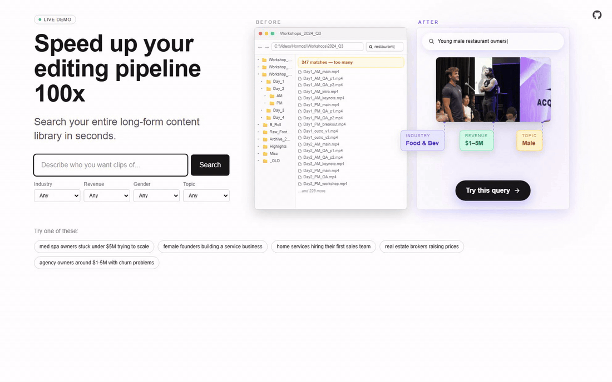

# Search and Retrieval Tool Long-Form Content Library

A production-grade AI-native search and retrieval system over a 500+ minute long-form Q&A workshop library. A non-technical editor types something like *"med spa owners doing under $5M"* and the system returns ranked, timestamped attendee sessions ready to drop into an edit.

The same retrieval surface is exposed three ways: a web portal for editors, a JSON API for internal tooling, and an MCP server for AI agents.


## What it costs to find one clip

| | Manual editor scrubbing | This system |
|---|---|---|
| Time per clip | 30 to 60 minutes | ~4.6s median (measured) |
| Cost per clip | $25 to $80 (30 to 60 min × $50 to $80 senior-editor rate) | $0.0018 (less than two-tenths of a cent) |
| Scales linearly with corpus | Yes (3x footage = 3x time) | No (10x footage = same latency) |
| Repeatable for a different ICP | Start the search from scratch | Same query in seconds |

Concrete per-month numbers for a studio finding 100 clips (100 × 30 min scrub time × $60/hr — the home page calculator lets you sweep these assumptions):

| | Editor scrubbing only | With this system |
|---|---|---|
| Search labor | 50 hours (100 × 30 min) | ~8 minutes (100 × 4.6s) |
| Labor cost at $60/hr | $3,000 | $0 |
| OpenAI inference | $0 | $0.18 |
| Fixed managed infra | $0 | $25 |
| **Total** | **$3,000** | **~$25** |

That is roughly a **~400x latency reduction** per clip and a **~120x all-in cost reduction** at 100 clips/month, before counting opportunity cost of the editor's time on the work that actually requires a human.

### Per-query cost breakdown

At OpenAI list pricing:

| Stage | Model | Tokens (typical) | Cost |
|---|---|---|---|
| Filter extraction | `gpt-4o-mini` | 530 in / 100 out | $0.000140 |
| Query embedding | `text-embedding-3-small` | ~30 | $0.0000006 |
| LLM judge re-rank | `gpt-4o-mini` | ~250 in / 30 out × 30 candidates | $0.001665 |
| **Total per query** |  | | **~$0.0018** |

Vector search (Qdrant) and Postgres reads add no marginal cost. Per-query cost is logged to `query_log` in Postgres; a rolling 24-hour sum drives the `DAILY_COST_CEILING_USD` circuit breaker (default $5) on both the homepage search path and `/api/search/sessions`.

### Indexing cost per TB of source footage

For a fresh ingest of 1 TB of source footage (~250 hours of 1080p workshop video at typical export bitrate, ~8 attendee sessions per hour, ~2,000 sessions total):

| Stage | Service | Math | Cost |
|---|---|---|---|
| Transcription | Deepgram nova-3 batch | 15,000 min × $0.0043/min | $64.50 |
| Tagging + audit | Claude Sonnet 4.6, two passes | 2,000 sessions × $0.005 | $10.00 |
| Session embeddings | text-embedding-3-small | 2,000 sessions × $0.000005 | $0.01 |
| Storage (Blob + Postgres + Qdrant) | Frames + rows + ~12 MB of 1536-d vectors | Free tier | ~$0 |
| **Total per TB, one-time** |  |  | **~$75** |

The current ~71-session corpus (~10 hours) re-ingests for about $0.40 in inference plus Deepgram transcription minutes.

## What it does

The corpus is a library of long-form workshop videos where one host fields questions from a rotating cast of business owners. Each video contains multiple attendee Q&A sessions back-to-back, with no chapter markers.

The system:

- Splits each video into individual attendee sessions using voice fingerprinting plus speaker-cluster boundary detection.
- Tags each session with structured attributes the host team actually filters on (industry, revenue band, attendee gender, conversation topics, summary, audit-verified quote).
- Indexes every session into Qdrant with an OpenAI text embedding plus the structured filters as payload.
- Serves a hybrid retrieval surface: natural-language filter extraction, dense vector retrieval, structured-filter intersection, and a final LLM re-ranker.

The editor never sees the pipeline. They type a query, get back a list of clips, click play, YouTube opens at the right second.

## Architecture

```
                       +--------------------------------------+
                       |           Web (Next.js 16)           |
                       |  - / homepage (server component)     |
                       |  - Mobile + desktop animated demos   |
                       |  - IP-count gate (5 free per 24h)    |
                       |  - Login (cookie-based bypass)       |
                       |  - /api/mcp (MCP server, token-gated)|
                       +------------------+-------------------+
                                          |
                            +-------------+-------------+
                            v                           v
              +-------------------------+   +-------------------------+
              |     Search pipeline     |   |        MCP tools        |
              |     (lib/sessions.ts)   |   |      (lib/search.ts)    |
              +------------+------------+   +------------+------------+
                           |                              |
            +--------------+---------------+              |
            v              v               v              v
       +---------+   +----------+   +----------+   +----------+
       | OpenAI  |   |  Qdrant  |   |   Neon   |   | Upstash  |
       | embed + |   |  vector  |   | Postgres |   |  Redis   |
       | judge   |   |  search  |   | (truth)  |   | (rate)   |
       +---------+   +----------+   +----------+   +----------+
                           ^
                           |
              +------------+------------+
              |     Ingest pipeline     |
              |       (Python)          |
              |  yt-dlp -> Deepgram ->  |
              |  Resemblyzer -> session |
              |  boundaries -> Claude   |
              |  tagger -> audit gate   |
              |  -> embed -> upsert     |
              +-------------------------+
```

## Ingest pipeline

`ingest/` is a Python pipeline organized as discrete stages so each can be re-run independently.

| Stage | Module | Output |
|---|---|---|
| Fetch | `stages/download.py` | Raw audio + video metadata via `yt-dlp` |
| Transcribe | `stages/transcribe.py` | Deepgram nova-3 word-level timestamps + speaker clusters |
| Voice fingerprint | `stages/diarize.py` | Resemblyzer compares each cluster to a reference clip of the host. A single `VOICE_MATCH_FLOOR` (0.60) separates host from attendee clusters |
| Session boundaries | `stages/sessions.py` | Per-video session start/end derived from cluster transitions, with hand-verified `boundary_overrides.py` for the 4 long-form videos |
| Frame extraction | `stages/scenes.py` | PySceneDetect splits each video into scenes; one keyframe is extracted at the midpoint of each scene |
| Tag | `stages/tag_session_v2.py` | Claude Sonnet 4.6 emits industry, revenue, gender, topics, summary, plus a verbatim supporting quote |
| Audit | `stages/tag_session_v2.py` | Separate Claude call judges whether the quote supports each tag. Failed tags fall back to `other` |
| Embed | `stages/embed.py` | OpenAI `text-embedding-3-small` over the residual session text + summary |
| Upsert | `stages/push.py` | Qdrant points keyed by `session_id` with structured payload (`vectors.py` provisions the collections) |
| Dedupe | `scripts/dedupe_sessions.py` | Cross-video summary-embedding similarity clusters near-duplicate sessions into `dup_group_id` |

The ingest pipeline writes ground-truth metadata to Neon Postgres and vector embeddings to Qdrant Cloud. Postgres is the source of truth for filters and metadata; Qdrant is the dense retrieval index.

## Search pipeline

`web/lib/sessions.ts` orchestrates the runtime search.

```
NL query
   |
   v
[1] extractFilters (gpt-4o-mini, structured-output JSON schema)
   | {industry, revenueBands[], gender, topics[], residualText}
   v
[2] embed (text-embedding-3-small over residualText OR raw query)
   |
   v
[3] Qdrant search with hard payload filter on revenue, gender, and
   | *explicitly-named* industry. The extractor returns industry_certain=true
   | only when the editor literally typed a specific industry term ("real
   | estate brokers", "med spa owners", "HVAC contractors"); those become
   | hard filters. When industry was inferred from a general descriptor
   | ("service-based businesses", "business owners"), it stays a soft signal
   | so the query isn't silently narrowed to one of 20 slugs. Topics remain
   | soft unless the editor picked them in the UI.
   | fetches k×20 candidates from Qdrant (OVERFETCH)
   v
[4] LLM judge pass (gpt-4o-mini) scores the top ~30 candidates
   | (JUDGE_INPUT_LIMIT) 0..1
   | for "is this what the editor asked for"
   v
[5] Collapse: same-video same-cluster, then cross-video dup_group_id
   |
   v
[6] Render: timestamped session cards with YouTube deep-link (?t=start_s-1)
```

## Evaluation

Two evaluations back the claim that this works for the actual product goal — given an editor's natural-language description, surface the right sessions. Both render on the home page's Golden Set section.

- **Demo eval** — `web/scripts/demo_eval.ts` runs the 9 demo queries (5 hero-animation queries + 4 cycling search-bar examples) through the live `searchSessions` pipeline. Writes `web/public/demo-eval-latest.json` with per-query top-3 hits, extracted filters, judge scores, and latency. Most recent run: 100% pass rate (every query returned ≥1 hit above the relevance floor), 97% mean top-1 judge confidence, ~4.6s median latency.
- **Filter eval** — `web/scripts/filter_eval.ts` runs the 25 hand-labeled queries in `eval/extraction_test_set.yaml` through `extractFilters` and grades per-field accuracy against human-written expectations. Then computes hard-filter fidelity (do revenue/gender match in returned sessions?) using the demo-eval results. Writes `web/public/filter-eval-latest.json`. Most recent run: 92% all-fields-correct extraction, 100% hard-filter fidelity.
- **Legacy moment recall** — `web/scripts/eval.ts` and `web/public/eval-latest.json` remain for moment-level recall@k testing, rendered at `/eval` (dev-only, gated by `ENABLE_DEV_ROUTES`).

## Reliability

- **Per-dependency health probes** (`web/lib/health.ts`) check Postgres (`select 1`), Qdrant (`getCollections`), OpenAI (`/v1/models`), and Redis (`/ping`) in parallel with a 4-second timeout each.
- **`/api/status`** returns the live `deps` snapshot alongside corpus stats. Returns 503 if any required dep is down (Postgres, Qdrant, or OpenAI).
- **Hourly cron probe** at `/api/health/check` (scheduled in `web/vercel.json`) runs the probes, persists each tick to the `health_checks` Postgres table (jsonb snapshot for forensic replay), and POSTs to `ALERT_WEBHOOK_URL` if any required dep is down. Gated by `CRON_SECRET` in production.
- **Per-query cost telemetry** is logged to `query_log` in Postgres. A rolling 24h sum feeds the `DAILY_COST_CEILING_USD` circuit breaker (default $5) on both the production homepage search path and `/api/search/sessions`. Shared helpers live in `web/lib/cost.ts`.
- **Rate limiting**: Upstash sliding-window 30 req/min per IP and fixed 10k/day global, enforced in `web/proxy.ts`. Fails closed when Redis is unreachable.
- **IP-count free tier**: anonymous IPs get 5 free searches per 24h (`lib/searchGate.ts`) before being redirected to `/login`. The password unlocks unlimited searches via a 30-day cookie.
- **On-call runbook**: per-dependency failure modes and first-three-things-to-check at `docs/failure-recovery.md`.

## Stack

**Ingest pipeline** (Python 3.12)
- `yt-dlp`, `ffmpeg`, Deepgram nova-3
- Resemblyzer for speaker fingerprinting
- Anthropic Claude Sonnet 4.6 (tagger + audit)
- OpenAI `text-embedding-3-small` (vector index)

**Web** (Next.js 16, React 19, Tailwind v4)
- Server components for the home page and result rendering
- Client components for the animated hero and progress UI
- Liquid-glass search animation with phased state machine (`requestAnimationFrame`)

**Storage**
- Neon Postgres (sessions, videos, query_log, eval_queries, eval_labels)
- Qdrant Cloud (dense vector index, structured payload filters)
- Vercel Blob (extracted frames)
- Upstash KV / Vercel KV (rate limiting + IP-count gate)

**Inference**
- OpenAI `gpt-4o-mini` for filter extraction (which also emits the residual
  query text used for embedding) and the LLM judge re-rank
- OpenAI `text-embedding-3-small` for retrieval embeddings
- Anthropic Claude Sonnet 4.6 for the ingest-time tagger + audit (one-time per session)

**Agent interface**
- `@modelcontextprotocol/sdk` server at `/api/mcp` exposes `search_moments` and `get_video` tools. Bearer-token gated by `MCP_TOKEN` (required, fails closed).

## Security model

- **No secrets in the repo**. `.env*` is gitignored; `.env.example` documents every required variable.
- **Prompt injection mitigation** at `web/lib/extract.ts`: the editor's free-text query is passed inside `<query>` XML tags with explicit instructions to treat its contents as data, never as instructions. The structured output schema acts as a second containment layer.
- **Constant-time password compare** in the login API (`web/app/api/login/route.ts`) to avoid timing-leak signal on a single-credential demo.
- **Cookie flags**: `httpOnly`, `sameSite=lax`, `secure` when HTTPS. 30-day rolling expiry.
- **Internal routes** (`/eval`, `/v/[id]`, `/api/eval/*`, `/api/search*`) are gated server-side by `ENABLE_DEV_ROUTES`. The home page does not depend on any of them.
- **Rate limits** at the proxy layer (`web/proxy.ts`): 30 req/min per IP, 10k/day global. Anonymous search count is per-IP, per-day, stored in Redis with a 24-hour TTL.
- **Client IP source**: trusts Vercel's `x-real-ip` first, then `x-vercel-forwarded-for`. The user-controllable leading entry of `x-forwarded-for` is never used as the rate-limit key.
- **Fail-closed posture**: when Redis is unreachable, both the per-request rate limit and the IP-count free-tier gate refuse the request rather than letting it through unmetered.
- **MCP endpoint** requires `MCP_TOKEN`; an unset token blocks every request.

## Project structure

```
acq_search_retrieval/
├── ingest/                  # Python pipeline (offline)
│   ├── pipeline.py          # Top-level orchestrator
│   ├── stages/              # download, transcribe, diarize, sessions, scenes, tag
│   ├── scripts/             # populate_sessions, retag_sessions_v2, dedupe_sessions
│   ├── boundary_overrides.py
│   └── schema.sql           # Neon Postgres schema
│
├── web/                     # Next.js 16 app
│   ├── app/
│   │   ├── page.tsx         # Home (server component, IP-gated search)
│   │   ├── login/           # Cookie-based password unlock
│   │   ├── eval/            # Golden-set dashboard (dev-only)
│   │   ├── v/[id]/          # Per-video moments debug (dev-only)
│   │   └── api/
│   │       ├── mcp/         # MCP server (search_moments, get_video)
│   │       ├── search*/     # JSON search endpoints (dev-only)
│   │       ├── login/       # Auth cookie issuer
│   │       ├── status/      # Corpus stats + per-dep health snapshot
│   │       └── health/check # Hourly cron probe target
│   ├── components/
│   │   ├── HeroAnimation.tsx        # Desktop animated demo
│   │   ├── MobileHeroAnimation.tsx  # Mobile cross-fade demo
│   │   ├── SearchProgressBar.tsx    # Stage-by-stage progress overlay
│   │   ├── CyclingExample.tsx       # Cycling "Try one of these" pill
│   │   ├── CostSection.tsx          # Per-TB / per-query cost panels
│   │   ├── SavingsCalculator.tsx    # Interactive labor-savings widget
│   │   ├── GoldenSetSection.tsx     # Demo-eval + filter-eval readout
│   │   └── FailureRecoverySection.tsx
│   ├── lib/
│   │   ├── sessions.ts      # Main search pipeline
│   │   ├── search.ts        # Per-moment search (used by MCP)
│   │   ├── extract.ts       # NL filter extraction (incl. industry_certain)
│   │   ├── searchGate.ts    # IP-count free tier
│   │   ├── env.ts           # Typed env access + devRoutesEnabled()
│   │   ├── taxonomy.ts      # Industry / revenue / topic / gender enums
│   │   └── health.ts        # Per-dep probes used by /api/status + cron
│   ├── proxy.ts             # Next.js 16 middleware (rate limit)
│   ├── vercel.json          # Hourly cron config for /api/health/check
│   ├── public/
│   │   ├── demo-eval-latest.json     # Generated by demo_eval.ts
│   │   ├── filter-eval-latest.json   # Generated by filter_eval.ts
│   │   └── eval-latest.json          # Generated by eval.ts (moment recall)
│   └── scripts/
│       ├── eval.ts          # Legacy moment-level recall harness
│       ├── demo_eval.ts     # Runs the 9 demo queries through searchSessions
│       ├── filter_eval.ts   # Grades extractor accuracy + filter fidelity
│       ├── hero_queries.ts  # Helper that runs the demo queries
│       └── record_demo.ts   # Generates docs/demo.gif from the live site
│
├── eval/
│   ├── golden_queries.yaml         # Hand-labeled retrieval ground truth
│   └── extraction_test_set.yaml    # 25 hand-labeled extraction test queries
│
├── docs/
│   ├── demo.gif                # Hero animation (regenerate via record_demo.ts)
│   └── failure-recovery.md     # On-call runbook
│
└── .env.example
```

## Next steps: hardening observability

Per-query cost telemetry (the `query_log` insert) and the `DAILY_COST_CEILING_USD`
circuit breaker (a rolling 24h spend sum that refuses new searches once the
ceiling is hit) currently run on both the dev-gated `/api/search/sessions` route
and the production homepage search path (`app/page.tsx` → `searchSessions`), via
the shared helpers in `web/lib/cost.ts`. Remaining hardening work:

- Move spend accounting off the hot path (e.g. a cached/aggregated counter)
  so the ceiling check doesn't add a Postgres round-trip to every homepage
  search.
- Alert on approaching the ceiling (not just enforce it), reusing the existing
  `ALERT_WEBHOOK_URL` plumbing.
- Add per-IP / per-token cost attribution so abuse can be traced, not just
  globally throttled.

## License

MIT.
